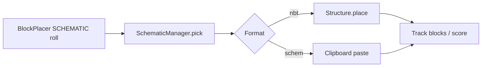

# Parkour schematics (LoParkour)

Jump structures are loaded from `plugins/LoParkour/schematics/` and matched to a **difficulty** in `plugins/LoParkour/schematics/schematics.yml`.

## Supported file types

| Extension | Source | Notes |
|-----------|--------|--------|
| `.nbt` | Vanilla structure block, `/structure save` | Pasted with Bukkit `StructureManager` |
| `.schem`, `.schematic` | WorldEdit (`//copy`, `//schem save`) | Read via embedded WorldEdit clipboard IO |
| `.lpschem` | **Legacy LoParkour format** | Not used in-game; convert with `/lp schematic convert` |

During parkour generation, when the profile rolls **schematic** type, the plugin picks a random file whose `difficulty` in YAML is **≤** the player's schematic setting (0.0–1.0).

## Difficulty keys (`schematics.yml`)

```yaml
difficulty:
  d0e227d2: 0.25   # short id (recommended)
```

For file `parkour-d0e227d2.schem` you can use key `d0e227d2` or the full stem `parkour-d0e227d2`.

Player setting **0.25 (easy)** → only structures with difficulty ≤ 0.25.  
**1.0** → any structure.

## Creating schematics in-game (admin)

1. Get the wand: `/lp schematic wand`
2. **Left-click** = position 1, **right-click** = position 2 (or use `/lp schematic pos1` / `pos2`)
3. Save and register:
   - `/lp create <difficulty>` — auto name `parkour-<hash>.schem` + YAML entry  
   - `/lp schematic create <difficulty>` — same  
   - `/lp schematic create <name> <difficulty>` — custom name (letters, numbers, `-`, `_`)

Difficulty examples: `0.25`, `0.5`, `0.75`, `1.0` (must be between 0 and 1).

4. `/lp schematic reload` — reload files without restart

## Converting old `.lpschem` files

Place `.lpschem` files in `plugins/LoParkour/schematics/` or legacy `schematics-new/`, then:

```
/lp schematic convert
```

Each file becomes `parkour-<id>.schem` in `schematics/` and gets a `difficulty:` entry (from the old metadata, or `0.5` if missing). Original `.lpschem` files are kept; delete them manually after checking.

## Admin commands

| Command | Description |
|---------|-------------|
| `/lp schematic wand` | Selection wand |
| `/lp schematic pos1` / `pos2` | Set corners at your feet |
| `/lp create <difficulty>` | Save selection → `.schem` + YAML |
| `/lp schematic create <name> <difficulty>` | Save with custom name |
| `/lp schematic convert` | Convert all `.lpschem` in schematics folders |
| `/lp schematic list` | List loaded structures |
| `/lp schematic paste <name>` | Test-paste at your location |
| `/lp schematic reload` | Reload disk files |

## Flow (runtime)



## Folders

- `plugins/LoParkour/schematics/` — `.nbt`, `.schem`, `.schematic` (active)
- `plugins/LoParkour/schematics/schematics.yml` — difficulty map
- `plugins/LoParkour/schematics-new/` — legacy; scanned only for `.lpschem` convert
